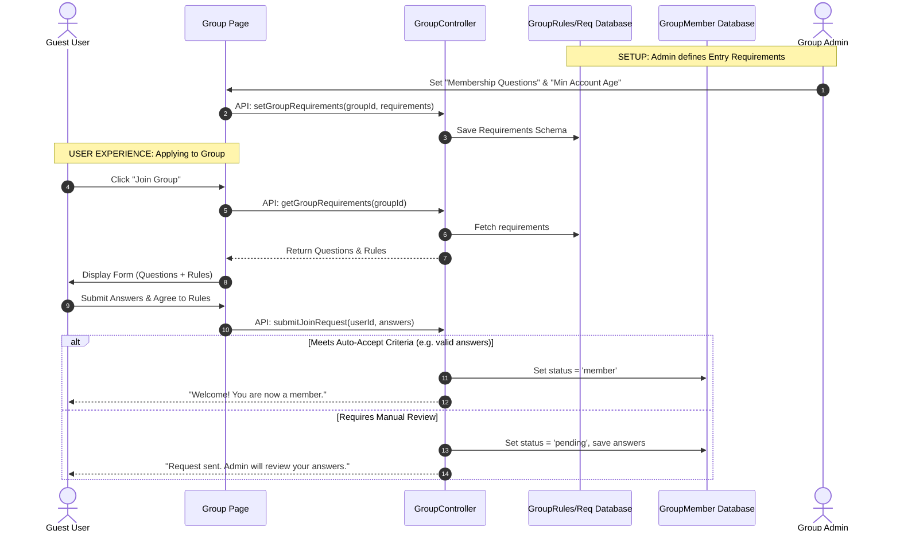

Sequence diagram manage group 

```mermaid
sequenceDiagram
    autonumber
    actor User as Guest User
    participant UI as Group Page
    participant Ctrl as GroupController
    participant RuleDB as GroupRules/Req Database
    participant MemberDB as GroupMember Database
    actor GAdmin as Group Admin

    Note over GAdmin, RuleDB: SETUP: Admin defines Entry Requirements
    GAdmin->>UI: Set "Membership Questions" & "Min Account Age"
    UI->>Ctrl: API: setGroupRequirements(groupId, requirements)
    Ctrl->>RuleDB: Save Requirements Schema
    
    Note over User, UI: USER EXPERIENCE: Applying to Group
    User->>UI: Click "Join Group"
    UI->>Ctrl: API: getGroupRequirements(groupId)
    Ctrl->>RuleDB: Fetch requirements
    Ctrl-->>UI: Return Questions & Rules
    
    UI->>User: Display Form (Questions + Rules)
    User->>UI: Submit Answers & Agree to Rules
    
    UI->>Ctrl: API: submitJoinRequest(userId, answers)
    
    alt Meets Auto-Accept Criteria (e.g. valid answers)
        Ctrl->>MemberDB: Set status = 'member'
        Ctrl-->>User: "Welcome! You are now a member."
    else Requires Manual Review
        Ctrl->>MemberDB: Set status = 'pending', save answers
        Ctrl-->>User: "Request sent. Admin will review your answers."
    end
```