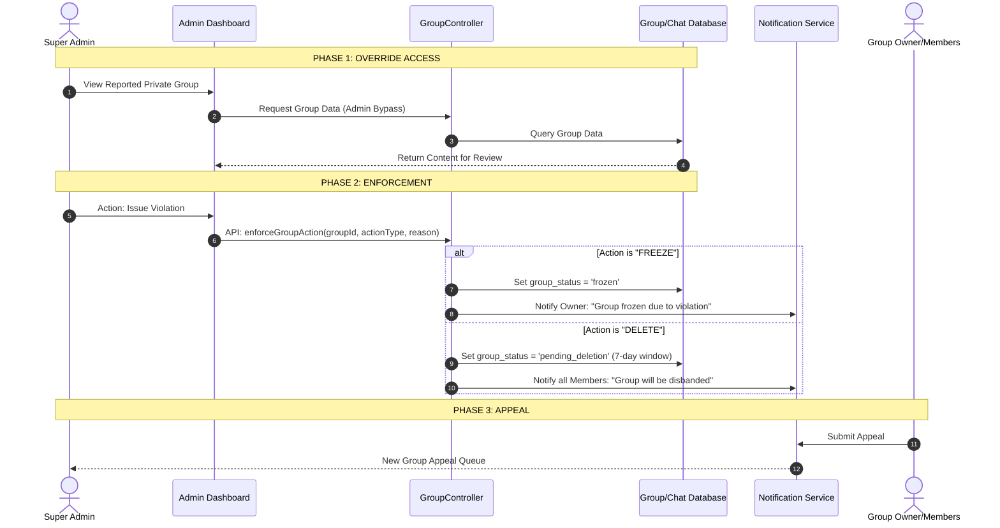

Sequence diagram manage group or chat group

```mermaid
sequenceDiagram
    autonumber
    actor Admin as Super Admin
    participant UI as Admin Dashboard
    participant Ctrl as GroupController
    participant GroupDB as Group/Chat Database
    participant Noti as Notification Service
    actor Owner as Group Owner/Members

    Note over Admin, GroupDB: PHASE 1: OVERRIDE ACCESS
    Admin->>UI: View Reported Private Group
    UI->>Ctrl: Request Group Data (Admin Bypass)
    Ctrl->>GroupDB: Query Group Data
    GroupDB-->>UI: Return Content for Review
    
    Note over Admin, GroupDB: PHASE 2: ENFORCEMENT
    Admin->>UI: Action: Issue Violation
    UI->>Ctrl: API: enforceGroupAction(groupId, actionType, reason)
    
    alt Action is "FREEZE"
        Ctrl->>GroupDB: Set group_status = 'frozen'
        Ctrl->>Noti: Notify Owner: "Group frozen due to violation"
    else Action is "DELETE"
        Ctrl->>GroupDB: Set group_status = 'pending_deletion' (7-day window)
        Ctrl->>Noti: Notify all Members: "Group will be disbanded"
    end

    Note over Owner, Admin: PHASE 3: APPEAL
    Owner->>Noti: Submit Appeal
    Noti-->>Admin: New Group Appeal Queue
```