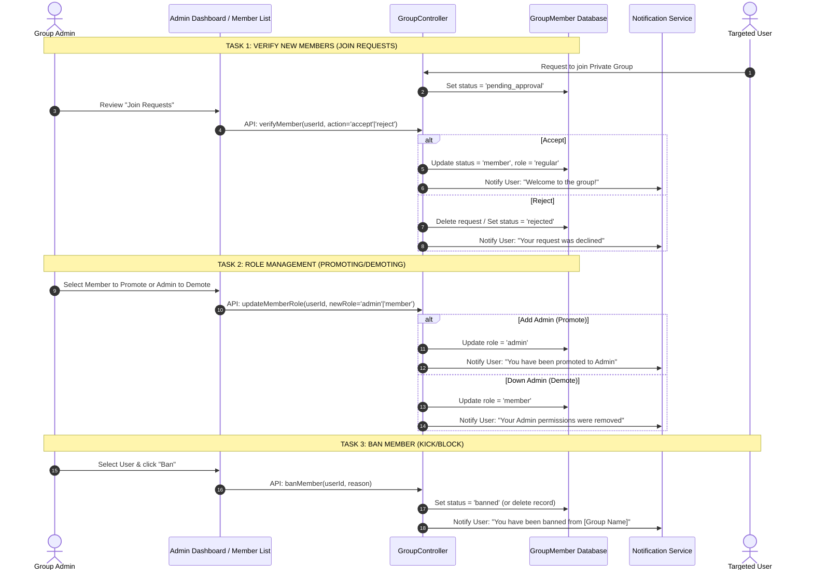

Sequence diagram manage member admin group

```mermaid
sequenceDiagram
    autonumber
    actor GAdmin as Group Admin
    participant UI as Admin Dashboard / Member List
    participant Ctrl as GroupController
    participant MemberDB as GroupMember Database
    participant Noti as Notification Service
    actor Target as Targeted User

    Note over GAdmin, MemberDB: TASK 1: VERIFY NEW MEMBERS (JOIN REQUESTS)
    Target->>Ctrl: Request to join Private Group
    Ctrl->>MemberDB: Set status = 'pending_approval'
    GAdmin->>UI: Review "Join Requests"
    UI->>Ctrl: API: verifyMember(userId, action='accept'|'reject')
    
    alt Accept
        Ctrl->>MemberDB: Update status = 'member', role = 'regular'
        Ctrl->>Noti: Notify User: "Welcome to the group!"
    else Reject
        Ctrl->>MemberDB: Delete request / Set status = 'rejected'
        Ctrl->>Noti: Notify User: "Your request was declined"
    end

    Note over GAdmin, MemberDB: TASK 2: ROLE MANAGEMENT (PROMOTING/DEMOTING)
    GAdmin->>UI: Select Member to Promote or Admin to Demote
    UI->>Ctrl: API: updateMemberRole(userId, newRole='admin'|'member')
    
    alt Add Admin (Promote)
        Ctrl->>MemberDB: Update role = 'admin'
        Ctrl->>Noti: Notify User: "You have been promoted to Admin"
    else Down Admin (Demote)
        Ctrl->>MemberDB: Update role = 'member'
        Ctrl->>Noti: Notify User: "Your Admin permissions were removed"
    end

    Note over GAdmin, Target: TASK 3: BAN MEMBER (KICK/BLOCK)
    GAdmin->>UI: Select User & click "Ban"
    UI->>Ctrl: API: banMember(userId, reason)
    Ctrl->>MemberDB: Set status = 'banned' (or delete record)
    Ctrl->>Noti: Notify User: "You have been banned from [Group Name]"
```