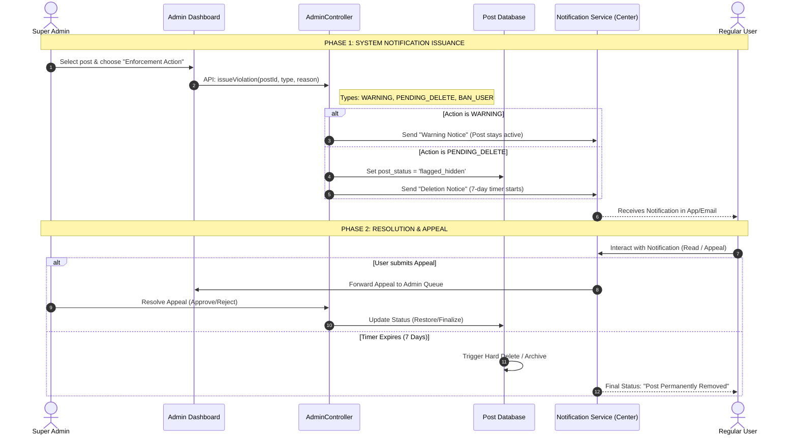

Sequence diagram manage post of super admin 

```mermaid
sequenceDiagram
    autonumber
    actor Admin as Super Admin
    participant UI as Admin Dashboard
    participant Ctrl as AdminController
    participant PostDB as Post Database
    participant Noti as Notification Service (Center)
    actor User as Regular User

    Note over Admin, User: PHASE 1: SYSTEM NOTIFICATION ISSUANCE
    Admin->>UI: Select post & choose "Enforcement Action"
    UI->>Ctrl: API: issueViolation(postId, type, reason)
    
    Note right of Ctrl: Types: WARNING, PENDING_DELETE, BAN_USER

    alt Action is WARNING
        Ctrl->>Noti: Send "Warning Notice" (Post stays active)
    else Action is PENDING_DELETE
        Ctrl->>PostDB: Set post_status = 'flagged_hidden'
        Ctrl->>Noti: Send "Deletion Notice" (7-day timer starts)
    end
    
    Noti-->>User: Receives Notification in App/Email

    Note over User, Admin: PHASE 2: RESOLUTION & APPEAL
    User->>Noti: Interact with Notification (Read / Appeal)
    
    alt User submits Appeal
        Noti->>UI: Forward Appeal to Admin Queue
        Admin->>Ctrl: Resolve Appeal (Approve/Reject)
        Ctrl->>PostDB: Update Status (Restore/Finalize)
    else Timer Expires (7 Days)
        PostDB->>PostDB: Trigger Hard Delete / Archive
        Noti-->>User: Final Status: "Post Permanently Removed"
    end
```