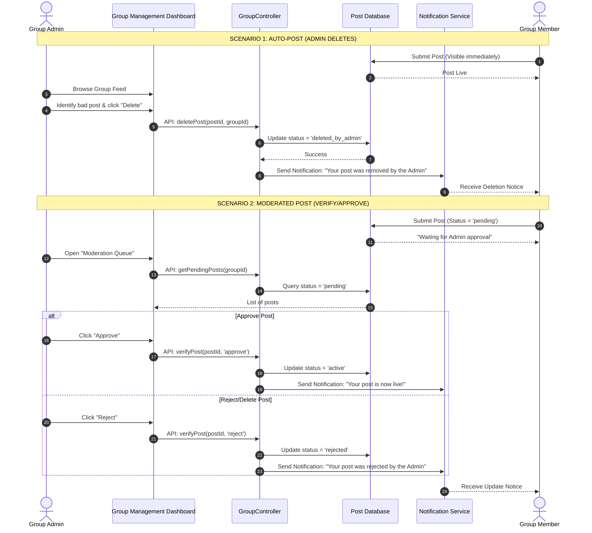

Sequence diagram manage post of admin group

```mermaid
sequenceDiagram
    autonumber
    actor GAdmin as Group Admin
    participant UI as Group Management Dashboard
    participant Ctrl as GroupController
    participant PostDB as Post Database
    participant Noti as Notification Service
    actor Member as Group Member

    Note over GAdmin, Member: SCENARIO 1: AUTO-POST (ADMIN DELETES)
    Member->>PostDB: Submit Post (Visible immediately)
    PostDB-->>Member: Post Live
    GAdmin->>UI: Browse Group Feed
    GAdmin->>UI: Identify bad post & click "Delete"
    UI->>Ctrl: API: deletePost(postId, groupId)
    Ctrl->>PostDB: Update status = 'deleted_by_admin'
    PostDB-->>Ctrl: Success
    Ctrl->>Noti: Send Notification: "Your post was removed by the Admin"
    Noti-->>Member: Receive Deletion Notice

    Note over GAdmin, Member: SCENARIO 2: MODERATED POST (VERIFY/APPROVE)
    Member->>PostDB: Submit Post (Status = 'pending')
    PostDB-->>Member: "Waiting for Admin approval"
    
    GAdmin->>UI: Open "Moderation Queue"
    UI->>Ctrl: API: getPendingPosts(groupId)
    Ctrl->>PostDB: Query status = 'pending'
    PostDB-->>UI: List of posts
    
    alt Approve Post
        GAdmin->>UI: Click "Approve"
        UI->>Ctrl: API: verifyPost(postId, 'approve')
        Ctrl->>PostDB: Update status = 'active'
        Ctrl->>Noti: Send Notification: "Your post is now live!"
    else Reject/Delete Post
        GAdmin->>UI: Click "Reject"
        UI->>Ctrl: API: verifyPost(postId, 'reject')
        Ctrl->>PostDB: Update status = 'rejected'
        Ctrl->>Noti: Send Notification: "Your post was rejected by the Admin"
    end
    
    Noti-->>Member: Receive Update Notice
```