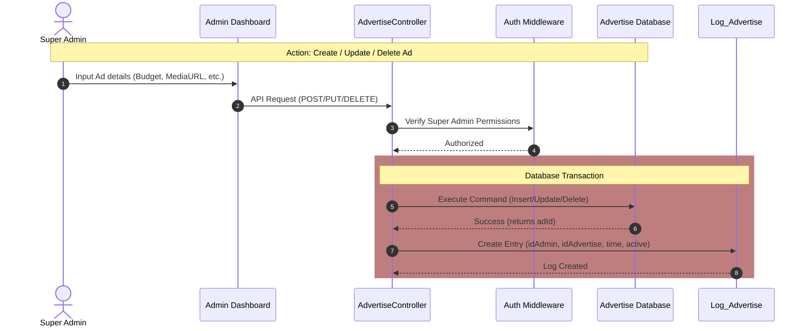

Sequence manage advertise

```mermaid
sequenceDiagram
    autonumber
    actor Admin as Super Admin
    participant UI as Admin Dashboard
    participant Ctrl as AdvertiseController
    participant Auth as Auth Middleware
    participant AdDB as Advertise Database
    participant LogDB as Log_Advertise

    Note over Admin, AdDB: Action: Create / Update / Delete Ad
    Admin->>UI: Input Ad details (Budget, MediaURL, etc.)
    UI->>Ctrl: API Request (POST/PUT/DELETE)
    
    Ctrl->>Auth: Verify Super Admin Permissions
    Auth-->>Ctrl: Authorized

    rect rgba(190, 126, 126, 1)
        Note over Ctrl, LogDB: Database Transaction
        Ctrl->>AdDB: Execute Command (Insert/Update/Delete)
        AdDB-->>Ctrl: Success (returns adId)
        
        Ctrl->>LogDB: Create Entry (idAdmin, idAdvertise, time, active)
        LogDB-->>Ctrl: Log Created
    end

```